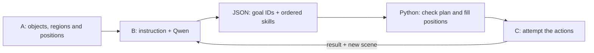

# Student B: make a plan with Qwen

Your job is to turn a request into steps the robot can try. A tells you what
the camera sees. You choose the object, destination and action order. C moves
the robot and reports what happened. If a step fails, you make a new plan.

The Qwen interface works with the live API. On September 7, 2026, it passed
**32/32 predefined B planning cases**, including search, clarification and
replanning. This is a measured result on that small test set, not a guarantee
for new instructions. See the [live validation report](validation/QWEN_B_LIVE.md).
You can still test offline without an API key or finished A/C.



## 1. Run B offline first

```bash
cd /home/jiamo/EE4705/project1.3
.venv/bin/python -m planner.run --offline-demo --out runs/qwen_b_offline
```

Use a new output folder on each run, for example `runs/qwen_b_offline_2`.
The command refuses to mix results with an existing run.

Expected output:

```text
READY: APPROACH -> GRASP -> MOVE_TO -> PLACE -> VERIFY -> STOP
Source: fixture
```

This command uses a hand-written response through `FakeTransport`.
It exercises the same parser, compiler, validator and audit code as a real
request. It does not contact Qwen or test language understanding.

| File in the output folder | What to look at |
| --- | --- |
| `input.json` | The instruction and A's scene |
| `scene.json` | Reusable `SceneDescription` input, without the instruction |
| `response.json` | Model-shaped JSON: goal IDs and skills; no coordinates |
| `schema.json` | The exact allowed JSON format |
| `plan.json` | The compiled backbone `Plan` that C receives |
| `diagnostics.json` | Source, model, prompt, raw response, validation, tokens and timing |
| `audit/<episode-id>/001.json` | The first planning call; later calls have increasing numbers |

The sample request is “Move the stone beside the blue cube to the red area.”
The hand-written answer selects stone `p0`. Cube `p1` is a reference object;
region `p2` is the destination. This illustrates the intended answer, not
evidence that Qwen understands this sentence.

## 2. Input and output

The public interface stays the same:

```python
plan = planner.plan(instruction, scene)
plan = planner.replan(instruction, new_scene, history, context, clarification=None)
planner.reset()
```

| Input | Meaning |
| --- | --- |
| `instruction` | The original user request; keep it unchanged during replanning |
| `scene` | A's `SceneDescription`: IDs, classes, colors, status and world positions |
| `history` | Previous action results, including failures such as `GRASP_MISSED` |
| `context.held_instance_id` | The object the system believes is in the gripper |
| `context.last_release_instance_id` | The most recently released object |
| `clarification` | The user's answer to B's earlier question, if any |

The model receives text and structured scene data. B does not need images.
IDs come from A; B never uses simulator object IDs or oracle positions.
The last 12 action results are included, with the total history length.
Executor-private `info` fields are excluded from model input.

Qwen returns a `student-b-plan-v1` JSON object with these required fields:

| Field | Meaning |
| --- | --- |
| `schema_version` | `student-b-plan-v1` |
| `status` | `READY`, `NEEDS_SEARCH`, `NEEDS_CLARIFICATION`, or `INFEASIBLE` |
| `goal` | `object_id`, `object_name`, `object_color`, `region_id`, `region_name` |
| `actions` | At most 16 actions; each has `skill`, `target`, `object`, `region`, `condition` |
| `reason` | A short reason, required for refusal |
| `clarification_question` | A question when clarification is needed |

Unused strings must be `""`. Unknown IDs must be empty, not invented.
An extra field such as model-generated `params.pos` is rejected.
The compiler also accepts a few harmless repeated IDs: for example,
`PLACE.region` may repeat `PLACE.target`. It clears these fields and records
each change in `diagnostics.json`. A conflicting ID is still rejected. The
raw response is kept unchanged, and all goal and action checks still run.
For example, the model writes:

```json
{"skill":"PLACE","target":"p2","object":"p0","region":"","condition":""}
```

Python uses A's region support point to produce:

```python
Action(Skill.PLACE, target="p2", params={"object": "p0", "pos": [0.4, 0.3, 0.853]})
```

Coordinates use the world frame and meters. Object positions are centers;
region positions are support points. `MOVE_TO` uses the region support point
plus the public 0.18 m transport clearance. Every positional action is bound
from the current scene, never from remembered coordinates.
C may refresh an action's position from newer perception before moving;
see `executor/demo_skills.py` for an example.

## 3. What is checked before C runs

- The JSON fields and types match the schema.
- Goal IDs exist and match the stated class, role and requested color.
- Metric actions use current, unambiguous `LOCALIZED` references.
- An empty-hand plan approaches or reaches before grasping the goal object.
- Transport and placement use that same object and the goal region.
- A ready plan ends with placement `VERIFY`, then `STOP`.
- A replan preserves every nonempty field of the accepted original goal.
- If a different object is held, B cannot silently place it as the requested object.
- A correctly held object is not grasped again. After release, B may verify
  or plan a correction using a new observation.

A held or recently released object may be absent from the current camera
view. Its tracked ID can still be used for a **future verification**. This
does not create a position, make it visible, or pass the final visual check.

`NEEDS_SEARCH` contains only SEARCH actions with canonical class names.
Search is class-based in the current C interface. B keeps color constraints
in its goal and must resolve the right instance after receiving a new scene.
Ambiguity produces a question and no actions. Unsupported requests produce
`INFEASIBLE`, a reason, and no actions.
The prompt includes candidate groups derived only from A's scene. If two
stones are visible and the request gives no way to choose, B must ask rather
than guess the gray or first stone. A missing destination also needs a
question. Holding the wrong object needs clarification while keeping the
original goal; it does not make the original transfer task unsupported.

An invalid model output gets **one repair request**, containing the rejected
output and exact validation error. A second invalid output raises `PlannerError`.
HTTP errors and timeouts also raise `PlannerError`; they are not task refusal.
The orchestrator records an error and stops. There is no automatic rule fallback.

These checks do not prove that the model understood the sentence. A consistent
plan for the wrong object can still pass on the first call. They also do not
prove that IK, grasping or placement will succeed. Language labels and actual
execution tests are both needed.

## 4. Run the offline tests

```bash
cd /home/jiamo/EE4705/project1.3
.venv/bin/python -m pytest -q tests/test_student_b.py tests/test_b_benchmark.py tests/test_llm_client.py tests/test_validation.py tests/test_architecture.py
```

These tests cover schema errors, invented IDs, forbidden coordinates, wrong
action order, bounded repair, service failures, goal preservation, fresh
positions, search, clarification, holding state, config and cache provenance.
A guard makes `RequestsTransport.post` fail if a B test tries live HTTP.

Run just the A/B/C integration check:

```bash
.venv/bin/python -m pytest -q tests/test_student_b.py::test_fixture_student_b_connects_to_real_simulated_demo_a_and_c
```

This uses a fixed response through the real B interface, demo RGB-D A and
demo motion C in MuJoCo. It checks the visual claim and an independent
evaluator's object identity, release, destination and stability checks.
It does not use Qwen. The fixed scene is not a randomized benchmark.

Run all project checks:

```bash
.venv/bin/python -m pytest -q
```

## 5. Connect Qwen

Do this section only when you want to make real API requests.
No new SDK is needed; the shared client uses the existing `requests` dependency.

The default model is `qwen3.7-plus-2026-05-26`. The default output mode is
`json_schema`. Use the **OpenAI-compatible** endpoint, because this client
sends Chat Completions requests. The Singapore endpoint tested in this run is:

```text
https://dashscope-intl.aliyuncs.com/compatible-mode/v1
```

Your key and endpoint must belong to the matching region/workspace. If your
console supplies a different OpenAI-compatible base URL, use that exact URL.
It should end in `/v1`, not `/chat/completions`.

In Bash, these commands read values without putting the key into shell history:

```bash
cd /home/jiamo/EE4705/project1.3
export EE4705_QWEN_BASE_URL='https://dashscope-intl.aliyuncs.com/compatible-mode/v1'
unset EE4705_QWEN_API_KEY  # remove any older override before reading this key
read -r -s -p 'Qwen API key: ' DASHSCOPE_API_KEY
echo
export DASHSCOPE_API_KEY
export EE4705_QWEN_MODEL='qwen3.7-plus-2026-05-26'
export EE4705_QWEN_OUTPUT_MODE='json_schema'
export EE4705_QWEN_CACHE_ONLY='false'
export EE4705_QWEN_CACHE_DIR=''  # use fresh responses for measured runs
.venv/bin/python -m planner.run --check-config
```

`--check-config` checks settings only. It sends no request and does not prove
that credentials, the model or structured output work at the endpoint.
The program reads environment variables, not `.env` files automatically.
Do not put keys in source files, command arguments, screenshots or reports.

Make one real planning request using the scene saved by Section 1:

```bash
.venv/bin/python -m planner.run \
  --scene runs/qwen_b_offline/scene.json \
  --instruction 'Move the stone beside the blue cube to the red area.' \
  --out runs/qwen_b_first_api
```

On a model/API error, `diagnostics.json` is also saved in the requested output
folder. Inspect it before running the robot simulation. Then try
your B with the existing working demo A/C and record a video:

```bash
.venv/bin/python -m demo.run --student B --out runs/qwen_b_episode
.venv/bin/python -m http.server 8766 --bind 127.0.0.1 --directory runs/qwen_b_episode
```

Open [the local replay](http://127.0.0.1:8766/). By default, the evaluator expects
the stone in the red region. Set `--expected-target cube` if the instruction
asks for the blue cube. This label is for the evaluator only and never enters B.
The separate planning evaluation uses mock A/C and may use other prepared trials:

```bash
.venv/bin/python -m eval.runner --mode planning --trials eval/trials/smoke --out runs/qwen_b_smoke
```

Optional settings:

| Environment variable | Default / use |
| --- | --- |
| `EE4705_QWEN_API_KEY` | Optional override of `DASHSCOPE_API_KEY`; no OpenAI-key fallback |
| `EE4705_QWEN_OUTPUT_MODE` | `json_schema`; explicitly choose `json_object` for a model without schema support |
| `EE4705_QWEN_THINKING` | Unset: omit provider flag; set `true` or `false` only if the chosen model supports it |
| `EE4705_QWEN_TIMEOUT_S` | `60` per HTTP attempt |
| `EE4705_QWEN_MAX_RETRIES` | `1` additional attempt for retryable HTTP/transport failures |
| `EE4705_QWEN_MAX_TOKENS` | `2048` |
| `EE4705_QWEN_CACHE_DIR` | `runs/qwen_cache`; empty string disables the cache |
| `EE4705_QWEN_CACHE_ONLY` | `false`; `true` requires an existing exact cached response and sends no HTTP |
| `EE4705_QWEN_AUDIT_DIR` | `runs/qwen_b_audit` |

The client never silently changes output mode or model. Both output modes
still run local validation. The default bounds allow at most four HTTP
attempts per planning call: initial + retry, then one repair + retry.
The orchestrator separately bounds replans and robot action attempts.

Cache entries distinguish `live`, `fixture` and `custom_transport` sources.
A live client cannot replay a fixture cache entry. `cached=true` means no new
model call; token/timing fields on a cache hit are zero for that call.
Cache keys include endpoint, model, messages, schema, mode and generation
settings. Invalid cached text is validated again. Client statistic
`live_requests` is a legacy name for uncached transport calls; with a fixture
it does not mean actual HTTP. Use `source` together with `cached` in reports.

Provider references, checked September 7, 2026:
[Qwen structured output](https://www.alibabacloud.com/help/en/model-studio/qwen-structured-output),
[compatible API](https://www.alibabacloud.com/help/en/model-studio/compatibility-of-openai-with-dashscope),
[Qwen3.7-Plus](https://www.alibabacloud.com/help/en/model-studio/qwen3-7-plus).
The endpoint and model above passed live authentication and schema-output
requests in the recorded run.

## 6. Measure B without waiting for A or C

Ground truth is the expected meaning of the request, written **before** asking
Qwen. It is not Qwen's own answer and not simply a valid JSON document.
The test files provide A-shaped scenes with known objects and positions.
They label the correct status, object ID, region ID and action dependencies.
The labels are never sent to the model.

| Example input | Expected result |
| --- | --- |
| One stone; “Move the stone to the red area.” | `READY`, that stone and red region; approach, grasp, move, place, verify, stop |
| Two stones; “Move the stone to the red area.” | `NEEDS_CLARIFICATION`, no guessed object ID, no motion |
| No stone visible; same request | `NEEDS_SEARCH`, search for `stone`; no invented ID |
| “Pour the bottle into the cube.” | `INFEASIBLE`; no supported pouring skill |
| Original stone goal; the stone is now held | Keep the goal; move, place, verify, stop; do not grasp again |
| Original stone goal; a cube is held instead | Keep the goal and ask for clarification |

Configure the API using Section 5, then run:

```bash
cd /home/jiamo/EE4705/project1.3
.venv/bin/python -m eval.b_benchmark \
  --suite eval/trials/student_b/development.json \
  --out runs/my_b_development --workers 2

.venv/bin/python -m eval.b_benchmark \
  --suite eval/trials/student_b/evaluation.json \
  --out runs/my_b_evaluation --workers 2
```

Each output folder must be new or empty. These commands make paid API requests
with the disk cache disabled. The development set has 13 cases; the evaluation
set has 32. Six evaluation cases contain an initial plan and a replan, so a
clean evaluation uses 38 model calls. Errors and repairs can increase requests.
The command exits with code 0 at accuracy >=90%, or 1 below that threshold.

Open the result page:

```bash
.venv/bin/python -m http.server 8766 --bind 127.0.0.1 --directory runs/my_b_evaluation
```

| Output | How to use it |
| --- | --- |
| `index.html` | Browse passes, failures and response times |
| `summary.json` | Correct/total, first-response accuracy, categories and all case results |
| `manifest.json`, `suite.json`, `source/` | Frozen labels, source snapshots, hashes and model settings |
| `<case>/case.json` | Full test input and the independent `expected` answer |
| `<case>/result.json` | Returned plan, selected goal and exact scoring errors |
| `<case>/audit/<episode>/001.json` | Model input, raw response, validation, tokens and latency |

`accuracy` is the fraction of whole cases whose final accepted plans match the
labels. A two-stage case must pass both stages. API errors count as failures.
`first_response_accuracy` applies the same semantic checks to each stage's
first model response, before a repair. The adapter's `first_pass_valid` only
means its structural checks passed; it does not prove the intended object was
selected. Only quote final results when `complete` is true.

To add a case, copy one in the development JSON and give it a new unique ID.
Edit `instruction`, `scene` and `expected` together. Use `initial`, `context`,
`history` and `clarification` for recovery cases, following the existing examples.
Decide the expected answer before running the model. These scenes are prepared
test inputs; replace some with real A outputs when A becomes available.

Tune on development cases. Freeze the prompt, compiler and labels before an
evaluation. The current evaluation has now been inspected: use it for regression
tests, and make a new unseen set for the next independent performance claim.

## 7. Watch and test recovery

These commands use live Qwen B with demo A/C and record all model calls:

```bash
# Force the first grasp to fail, then ask B for a new plan.
.venv/bin/python -m demo.run --student B --scenario retry \
  --attempts-per-action 1 --out runs/my_b_replan

# Test another target. The expected label is chosen independently of B.
.venv/bin/python -m demo.run --student B \
  --instruction 'Move the blue cube to the red area.' \
  --expected-target cube --out runs/my_b_cube
```

With the default two attempts per action, C retries the injected grasp failure
locally. Using one attempt sends the failure to B. In the replay, inspect
`B.model`, `B.plan`, the failed `C.end`, and the second `B.model`. Its input
should contain `GRASP_MISSED` and the original goal. Check `actual.checks` for
the independently evaluated identity, release, region and stability.

The recorded development run is available locally:

```bash
.venv/bin/python -m eval.b_report runs/qwen_b_refine_20260907
.venv/bin/python -m http.server 8767 --bind 127.0.0.1 \
  --directory runs/qwen_b_refine_20260907
```

Open [plans and recorded episodes](http://127.0.0.1:8767/). The report preserves
the original API failure, both development rounds and six videos, including
failed placement before the C fix and an absent-target case that cannot finish.
`runs/` is local and ignored by Git; copy that folder yourself if you need to
archive the raw records. Do not include any API credential file.

## 8. Your next development work

Start with `planner/prompts.py` for wording changes. Use `planner/contract.py`
for supported plan shapes and checks, `planner/config.py` for settings and
`planner/student_b.py` for request/repair/replan behavior. Keep the A/B/C
method signatures unchanged.

Extend coverage with new labelled instructions, scenes from A, multiple regions,
and more difficult spatial relations. Work with C on color-aware search: its
current class-only search can find the wrong-colored stone and cause repeated
searches. B preserves the color constraint, but C's search result needs to give
B enough information to decide what to do next.

Report language planning accuracy separately from schema validity, repair
rate, latency and execution success. Keep `first_pass_valid`, final validity
after repair and `source`/`cached` in the records. Do not report the fixed
offline responses as correct Qwen predictions. See the general
[student guide](STUDENT_README.md#3-student-b-turn-instructions-into-actions)
for the assignment's evaluation requirements.
