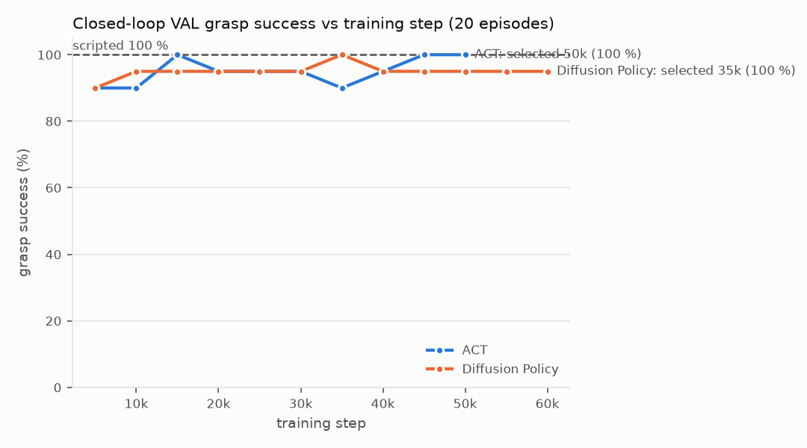
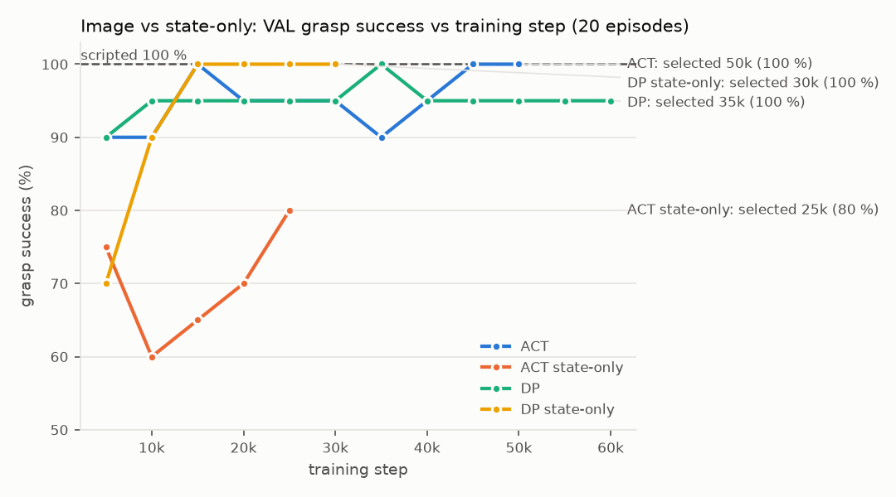
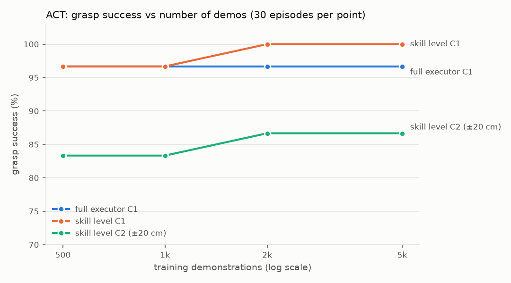

# Bonus: learned grasp policies (ACT, Diffusion Policy) vs the scripted skill — results

Branch `learned-grasp`. Everything below uses **0 live API calls**: GT perception (`core.mocks.GTPerception`),
`RulePlanner`, and the real `StudentCExecutor` on the MuJoCo G1 platform (weld attachment). Seeds are fixed
and recorded; the raw outputs are under `runs/bonus/` (git-ignored except the status files).
The step-by-step log is `runs/bonus/PROGRESS.md`.

## Setup in one paragraph

The learned policies sit **behind the existing grasp interface**. `executor/learned_grasp.py`
has `LearnedGraspSkill(policy, ckpt)(env, pos_world) -> SkillResult`, which takes the same call as
`core.skills.grasp`. Both executor call sites call `grasp_primitive()`, selected by `EE4705_GRASP_POLICY ∈ {scripted, act, diffusion}` (default `scripted`, so behaviour is unchanged).
From the post-APPROACH pose the skill runs the policy closed-loop at 10 Hz for ≤ 15 s. Each tick it reads the
arm q (7), the target position in the base frame (3) and the head camera (224², image policies only), then commands the
next arm joint setpoint. When the rollout ends it calls `try_attach_near_ee()` **once**, as the script does. The
executor's post-conditions are unchanged: the lift check, the held-instance bookkeeping, and the evaluator's oracle spy.
`core/types.py`, `core/interfaces.py` and the `skills.py` signatures are untouched. The only additions are two
proprioceptive accessors on `RobotEnv` (`get_arm_q`, `set_arm_joint_target`).

**When the rollout ends (chosen on VAL only, before any test cell was run).** The rollout ends when (a) the TCP
comes within 2.5 cm of the scripted grasp point (checked every 20 ms), (b) the commanded motion settles for 0.5 s
**within 5 cm** of that point, or (c) at the 15 s limit. v1 used the script's own 1.2 cm REACH tolerance, which gave
ACT 8/20 on VAL at 5k: the demos descend, pause and lift, so the policy passed within 1.3–2 cm and then lifted away.
v2 also stopped on any 0.5 s pause; three VAL episodes then stopped 20 cm away even though the policy would have
resumed and attached. With 2.5 cm the TCP is at most 4.5 cm from the object centre, inside the 5 cm attach radius,
so the rule never fires where attaching is geometrically impossible.

## Data and training

* **Demos** (`scripts/bonus/collect_grasp_demos.py`, seed 0): scripted APPROACH (arm tucked; parking perturbed by ±3 cm
  and ±5°) → REACH+GRASP → 0.5 s lift. Targets are stone or cube at ±10 cm around the canonical pose, yaw uniform, one
  distractor in 50 % of episodes; bottle excluded. 2,030 tried, **2,019 kept (expert 99.5 %)**, median 28 steps
  (2.8 s) at 10 Hz. `runs/bonus/demos_manifest.json`.
* **Dataset** (`scripts/bonus/to_lerobot.py`): LeRobotDataset with `observation.image` (224×224), `observation.state`
  (q ⊕ target, 10-D) and `action` (next q, 7-D). lerobot 0.6.1 only writes codebase **v3.0**, not v2. Split 90/10 by
  episode: 1,800 train / 200 val episodes, 57,402 train frames.
* **Training** (`scripts/bonus/train_policy.py`): lerobot's own `make_policy`, optimizer/scheduler presets, processors
  and ImageNet image stats. The data path is replaced by a uint8 memmap of the same episodes (verified identical to
  the LeRobotDataset), because `lerobot-train` was data-bound at 3 it/s on this machine; the memmap path runs at
  13 it/s. Seed 1000.
  * ACT: chunk 50, n_action_steps 25, ResNet-18 (ImageNet), batch 32, lr 1e-5, 50k steps.
  * Diffusion Policy: horizon 32, n_action_steps 8, n_obs_steps 2, DDIM 10 inference steps (100 train
    timesteps), ResNet-18, batch 64, lr 1e-4, 60k steps.
* **Checkpoint selection**: 20 closed-loop VAL episodes every 5k steps. VAL uses the C1 distribution with seed 500,
  disjoint from every test seed; the highest score wins, ties going to the latest step. ACT → 50k (20/20),
  DP → 35k (20/20). Neither needed the < 30 % retry ladder.



*Each curve point is 20 episodes, so one episode = 5 %. The curves are flat from 10k on: both policies are at
the resolution limit of the VAL set.*

## Evaluation protocol

`scripts/bonus/make_cells.py` writes `eval/trials/bonus_c{1..4}` with 30 trials each. Every policy sees the **same
trial files**, i.e. the same seeds and layouts:

| Cell | Scene | Seed |
|---|---|---|
| C1 in-distribution | stone/cube ±10 cm, distractor in 50 % | 1001 |
| C2 position shift | stone/cube ±20 cm | 1002 |
| C3 OOD object | bottle ±10 cm (never in training) | 1003 |
| C4 near distractor | stone/cube ±10 cm, a distractor always within a 0.3–3 cm surface gap | 1004 |

* **Full executor**: `eval.runner --mode manipulation` (`scripts/bonus/run_stage6.sh`) runs the whole
  APPROACH→GRASP→MOVE_TO→PLACE→VERIFY→STOP episode, including the executor's grasp retry and replanning.
  *Grasp success* means the first GRASP action holds the intended object, according to the oracle spy.
* **Skill level**: `scripts/bonus/eval_grasp.py` makes one grasp call from the Stage-1 post-APPROACH state on the
  same scene distributions, and reports the exact time-to-attach.

<!-- TABLES:BEGIN (scripts/bonus/make_results.py --write) -->
### Full executor: grasp success (first GRASP holds the intended object), 30 episodes/cell

| Policy | C1 in-dist. | C2 ±20 cm | C3 bottle (OOD) | C4 near distractor | WRONG_OBJECT | undetected | false claims |
|---|---|---|---|---|---|---|---|
| Scripted skill | 29/30 | 30/30 | 29/30 | 30/30 | 0 | 0 | 0 |
| ACT | 29/30 | 26/30 | 0/30 | 30/30 | 0 | 0 | 0 |
| Diffusion Policy | 29/30 | 27/30 | 0/30 | 30/30 | 0 | 0 | 0 |

### Full executor: task success (object placed in the region, oracle)

| Policy | C1 in-dist. | C2 ±20 cm | C3 bottle (OOD) | C4 near distractor |
|---|---|---|---|---|
| Scripted skill | 29/30 | 30/30 | 29/30 | 30/30 |
| ACT | 29/30 | 28/30 | 0/30 | 30/30 |
| Diffusion Policy | 29/30 | 27/30 | 0/30 | 30/30 |

### Full executor: learned-grasp failures and the unchanged post-condition

| Policy | learned-skill calls | misses (no attach) | GRASP actions reported success / failed (≤ 2 skill calls each) | episodes recovered after a miss | undetected (reported success, wrong/no object) | false task claims |
|---|---|---|---|---|---|---|
| ACT | 366 | 279 | 87 / 156 | 2 | 0 | 0 |
| Diffusion Policy | 554 | 467 | 87 / 250 | 1 | 0 | 0 |

### Skill level: grasp success and mean time-to-attach, 30 episodes/cell

| Policy | C1 in-dist. (t̄ s) | C2 ±20 cm (t̄ s) | C3 bottle (OOD) (t̄ s) | C4 near distractor (t̄ s) | WRONG_OBJECT |
|---|---|---|---|---|---|
| Scripted skill | 30/30 (3.02) | 29/30 (2.78) | 27/30 (2.77) | 30/30 (2.98) | 0 |
| ACT | 30/30 (3.18) | 26/30 (2.70) | 0/30 (—) | 30/30 (2.83) | 0 |
| Diffusion Policy | 30/30 (3.20) | 25/30 (3.04) | 1/30 (2.02) | 27/30 (3.05) | 0 |

### Ablations on C1 (30 episodes each)

| Variant | full executor C1 (grasp) | skill level C1 | mean time-to-attach (skill, s) | undetected |
|---|---|---|---|---|
| ACT n_action_steps 10 | 29/30 | 27/30 | 3.23 | 0 |
| ACT n_action_steps 25 (trained) | 29/30 | 30/30 | 3.18 | 0 |
| ACT n_action_steps 50 | 29/30 | 29/30 | 2.71 | 0 |
| DP DDIM 5 steps | 29/30 | 30/30 | 3.22 | 0 |
| DP DDIM 10 steps (trained) | 29/30 | 30/30 | 3.20 | 0 |
| DP DDIM 50 steps | 29/30 | 30/30 | 3.28 | 0 |
| DP DDPM 50 steps | 29/30 | 30/30 | 3.30 | 0 |
| ACT state-only | 29/30 | 26/30 | 2.23 | 0 |
| DP state-only | 29/30 | 30/30 | 2.68 | 0 |

<!-- TABLES:END -->

Notes on reading the tables:

* C1 is 29/30 for **every** policy because trial c1_11 exits with LIMIT_EXCEEDED before any GRASP. That is a
  navigation/search failure, identical for the script, so C1 cannot separate the policies. The skill-level C1
  (30/30 for all three) is the cleaner comparison.
* "Undetected" counts GRASP actions that reported success without holding the intended object. It is **0** for every
  policy and cell, and so are false task claims.

## Where the learned policies win, and where they lose

* **Parity in-distribution.** On C1 and C4 both learned policies match the script, at the full-executor level and the
  skill level. With a distractor 0.3–3 cm from the target, neither grabbed the wrong object (WRONG_OBJECT 0): the
  target position in the state pins the grasp.
* **Time-to-attach** is close to the script's: 2.8–3.2 s against 2.8–3.0 s. ACT with n_action_steps 50 is the
  fastest variant (2.71 s on C1).
* **Position shift (C2)** costs 3–5 trials. The misses cluster on the same far layouts for both policies (c2_04,
  c2_16, c2_20), which lie outside the ±10 cm training range. For ACT, the executor's unchanged retry recovered 2 of
  its 4 first-attempt misses.
* **OOD object (C3) is a clean failure for both** (0/30 full executor; DP 1/30 at skill level). Target z was
  constant in training (stone/cube centre 0.875 m); the bottle centre is 3.5 cm higher. The policies reach for
  stone/cube height (median closest approach 14–17 cm) and never attach. The script, which just reaches the given
  point, gets 29/30. Every one of these failures was **reported** as a failure: 0 false claims.

## Ablations

* ACT n_action_steps {10, 25, 50} and DP samplers {DDIM 5, DDIM 10, DDIM 50, DDPM 50} give 29/30 on C1 at
  full-executor level. Skill level separates them a little: ACT 27, 30 and 29/30; DP 30/30 for every sampler, so
  5 DDIM steps are enough here. More open-loop steps (ACT 50) make the grasp faster at no cost on C1.
* **Image vs state-only.** lerobot's ACT and DP refuse robot-state-only input, so the state-only variants feed q as
  `observation.state` and the target position as `observation.environment_state` (the same numbers, split). They
  were trained at the retry-ladder lengths (ACT 25k, DP 30k steps). The head camera sees the target only at the
  lower image edge from the parking pose, yet **ACT needs it**: state-only ACT peaks at 16/20 on VAL (image ACT
  18–20/20 from 5k on) and drops to 26/30 at skill level on C1. The executor's retry hides the gap at full-executor
  level (29/30). **DP does not need it**: state-only DP reaches 20/20 on VAL from 15k, 30/30 at skill level, and
  attaches faster (2.68 s against 3.20 s). A plausible reading: ACT's transformer has only two non-visual tokens
  without the image and is less stable to train on them (its VAL curve dips to 12/20 at 10k), whereas DP's
  FiLM-conditioned U-Net uses low-dimensional conditioning directly.



## Videos

Rendered through the existing Recorder (`eval.runner --video`) by `scripts/bonus/make_videos.sh`. The overlay says
"C: student" because the learned skill runs inside the unchanged StudentCExecutor.

| Policy | Success | Failure | OOD (bottle) |
|---|---|---|---|
| ACT | [c1_00](videos/act_success_c1_00.mp4) | [c2_04](videos/act_failure_c2_04.mp4) | [c3_00](videos/act_ood_c3_00.mp4) |
| Diffusion Policy | [c1_00](videos/diffusion_success_c1_00.mp4) | [c2_20](videos/diffusion_failure_c2_20.mp4) | [c3_00](videos/diffusion_ood_c3_00.mp4) |

## Reproduce

```bash
python scripts/bonus/collect_grasp_demos.py --n-keep 2000 --workers 10 --seed 0
python scripts/bonus/to_lerobot.py --demos runs/bonus/demos --root runs/bonus/lerobot/grasp_2k --max-episodes 2000
scripts/bonus/train.sh act_base act 50000 runs/bonus/lerobot/grasp_2k
scripts/bonus/train.sh diffusion_base diffusion 60000 runs/bonus/lerobot/grasp_2k
python scripts/bonus/make_cells.py --n 30
scripts/bonus/run_stage6.sh act act runs/bonus/best/act          # + scripted, diffusion
python scripts/bonus/eval_grasp.py --policy act --ckpt runs/bonus/best/act --cell C1 --n 30 --out ...
python scripts/bonus/make_results.py --write
```

## Stage 8 — continued improvements

### 8.1 More data: ACT trained on 500 / 1k / 2k / 5k demonstrations

The recipe is the same for every size (50k steps, checkpoint picked on VAL). Datasets are the first N kept episodes,
so they are nested; the 5k set is 5,005 kept of 5,033 tried (expert 99.4 %).

| Demos | Selected (VAL) | Full executor C1 | Skill C1 (t̄ s) | Skill C2 ±20 cm |
|---|---|---|---|---|
| 500 | 35k (20/20) | 29/30 | 29/30 (2.86) | 25/30 |
| 1k | 40k (20/20) | 29/30 | 29/30 (2.52) | 25/30 |
| 2k | 50k (20/20) | 29/30 | 30/30 (3.18) | 26/30 |
| 5k | 50k (20/20) | 29/30 | 30/30 (2.84) | 26/30 |



**The curve is flat.** 500 demonstrations already saturate the in-distribution task; C1 cannot separate the sizes
(the full-executor miss is c1_11, which never reaches GRASP). The position-shift cell C2 moves by one episode
between 1k and 2k and not at all to 5k. More data from the *same* ±10 cm distribution does not teach the policy
positions outside it. Coverage matters, not volume.

### 8.2 Bottle demonstrations in training (ACT, 2k stone/cube + 503 bottle demos)

503 scripted bottle demos (583 tried; the expert itself succeeds only 86 % on bottles) were added to the 2k set.
Recipe unchanged, 50k steps. The checkpoint was chosen on VAL (stone/cube, seed 500) + **VAL3** (bottle, seed 503,
disjoint from the C3 test seed 1003); the best combined score was 10k with 20/20 + 14/20. VAL3 fluctuates between
8 and 15/20 across checkpoints, so bottle grasping is learned but noisier.

| ACT | C3 bottle, full executor (first grasp / task) | C3 skill level | C1 full executor | C1 skill level |
|---|---|---|---|---|
| 2k demos (before) | 0/30 / 0/30 | 0/30 | 29/30 | 30/30 |
| 2k + 503 bottle (after) | 21/30 / 26/30 | 23/30 (3.26 s) | 29/30 | 29/30 (2.75 s) |
| Scripted (reference) | 29/30 / 29/30 | 27/30 | 29/30 | 30/30 |

Coverage fixes what volume could not (compare 8.1): C3 goes from 0 to 26/30 tasks, and the executor's retry turns
5 first-grasp misses into successes. There is no in-distribution regression. False claims and undetected failures
stay at 0.

### 8.3 Learned PLACE (ACT, same recipe)

`LearnedPlaceSkill` replaces only PLACE's carry: `skills.move_to(env, release_pos)` from the post-MOVE_TO pose down to
the release pose, selected with `EE4705_PLACE_POLICY`. Opening the gripper, the release (`skills.place`), the retreat
and the vision placement check are unchanged; the executor still rejects a carry that ends more than 1.2 cm from the
release pose. The grasp stays scripted. Demos come from 2,007 full scripted pick-and-place episodes (99.9 %),
recording only the PLACE carry: 7 steps each, 0.4 s of motion plus 0.3 s of holding. Checkpoint VAL is 20 full
episodes (seed 500): 20/20 at every checkpoint, so 50k was selected.

| PLACE carry | C1 task | C2 task | C4 task | final object offset from region centre, mean / p90 (C1) | TCP error at release (C1) |
|---|---|---|---|---|---|
| Scripted (`skills.move_to`) | 29/30 | 30/30 | 30/30 | 0.45 / 0.85 cm | < 1.2 cm by construction |
| Learned (ACT) | 29/30 | 26/30 | 30/30 | 0.33 / 0.65 cm | 1.07 cm mean |

The offset is measured by the executor's own placement check with GT perception, over successful episodes. On
in-distribution layouts the learned carry matches the script and places slightly closer to the centre (C4 is
similar: 0.35 cm against 0.71 cm). On the far C2 layouts it fails 4/30: the arm arrives at post-MOVE_TO poses the
demos never covered, the carry times out (mean release error 10 cm over those 66 calls), and the executor reports
PLACE:TIMEOUT. Again **0 false claims**: every failed carry was caught by the unchanged post-conditions.

**8.3b: coverage for PLACE too.** 1,011 extra place demos from ±20 cm scenes (seed 4; 98.9 %) were added
(3,000 episodes) and the same recipe retrained, selecting 50k (VAL 20/20):

| PLACE carry | C1 task | C2 task | C1 offset mean / p90 | C2 offset mean |
|---|---|---|---|---|
| Scripted | 29/30 | 30/30 | 0.45 / 0.85 cm | 0.87 cm |
| Learned, 2k in-range demos | 29/30 | 26/30 | 0.33 / 0.65 cm | 0.35 cm |
| **Learned, + 1k ±20 cm demos** | **29/30** | **29/30** | **0.21 / 0.59 cm** | 0.37 cm |

With the far layouts covered, the learned carry is within one episode of the script on C2. It still places closer
to the region centre than the scripted `move_to`, whose target is the centre but which stops anywhere inside its
1.2 cm tolerance. Adopted as the best learned PLACE.

### 8.6 (extra) Position coverage: + 1,000 demos at ±20 cm

Following 8.1, where volume did not help and coverage did: 1,000 scripted demos at ±20 cm (seed 3; 1,007 kept of
1,037, 97.1 %) were added to the 8.2 set, giving 3,503 episodes, and ACT was retrained with the same recipe. The
checkpoint was chosen on VAL + VAL2 (±20 cm, seed 502) + VAL3 (bottle, seed 503): 30k scored 20 + 19 + 13 of 60.

| ACT | C1 full / skill | C2 full (first grasp / task) / skill | C3 full (first grasp / task) / skill | final50 |
|---|---|---|---|---|
| 2k | 29 / 30 | 26 / 28 / 26 | 0 / 0 / 0 | 38/50 |
| 2k + bottle (8.2) | 29 / 29 | — | 21 / 26 / 23 | **47/50** |
| 2k + bottle + ±20 cm (8.6) | 29 / 30 | **28 / 29 / 28** | 17 / 15 / 22 | 44/50 |
| Scripted | 29 / 30 | 30 / 30 / 29 | 29 / 29 / 27 | 48/50 |

**Mixed.** The wider positions fix C2 (skill 26 → 28/30) and the far final50 target f20, but full-executor bottle
performance drops (C3 tasks 26 → 15/30; 4 final50 bottle trials lost). The bottle share of the data fell from
20 % to 14 %. Net on final50: 44 against 47, so under the one-fair-attempt rule this variant is **not adopted**, and
the best learned grasp remains ACT 2k + bottle. A plausible next step would be to rebalance the classes (upsample
the bottle demos), but that would be a second attempt at the same item.

### Seed variance (ACT, 2k recipe, three training seeds)

| Seed | Full C1 | Full C2 (first grasp / task) | Skill C1 | Skill C2 | Skill C4 |
|---|---|---|---|---|---|
| 1000 (reported) | 29/30 | 26 / 28 | 30/30 | 26/30 | 30/30 |
| 1001 | 29/30 | 26 / 28 | 30/30 | 26/30 | 28/30 |
| 1002 | 29/30 | 26 / 28 | 29/30 | 26/30 | 29/30 |

The headline numbers do not depend on the seed. Differences of 1–2 episodes per 30 between variants elsewhere in
this report are within seed noise; the C3 (0 → 26) and C2 (26 → 28–29) coverage effects are not.

### 8.4 All 50 `final50` trials, manipulation mode (GT perception + RulePlanner + StudentCExecutor, 0 API)

Runner score: the expected outcome, whether success, reject or clarify, was reached.

| Grasp | Score | Manipulation trials correct | False claims |
|---|---|---|---|
| Scripted | 48/50 | 45/47 | 0 |
| ACT (2k demos) | 38/50 | 35/47 | 0 |
| Diffusion Policy (2k demos) | 38/50 | 35/47 | 0 |
| **ACT, 2k + bottle demos (8.2)** | **47/50** | **44/47** | 0 |
| ACT, 2k + bottle + ±20 cm (8.6) | 44/50 | 41/47 | 0 |
| ACT 2k + bottle grasp **and** learned PLACE (8.3b) | 43/50 | 40/47 | 0 |

The 10 trials that only the learned grasps lose are **9 bottle trials** (the OOD object) plus f20, whose target
(stone2 at (0.60, 0.20)) lies ~20 cm outside the training range, as in C2. f41 (bottle) and f43 (a paraphrase that
the rule planner refuses) fail for every grasp. Every learned-grasp failure ended as FAILED or SEARCH_EXHAUSTED,
never as a claimed success. Raw data: `runs/bonus/final50/<policy>/rows.json`.

**After 8.2** the bottle-trained ACT recovers all 9 bottle trials: 47/50 against the script's 48/50. The only
remaining difference is f20, the target 20 cm outside the trained position range.

**Both skills learned** (grasp ACT 2k + bottle, place ACT with ±20 cm place demos): 43/50, again with 0 false
claims. The learned PLACE adds four losses, all coverage gaps and all reported as PLACE failures. Three carry a
bottle (f14, f25, f31), which never appeared in the place demos. The fourth, f04, is a SEARCH trial in which the
robot starts facing away, so it reaches the region from an unseen pose.
