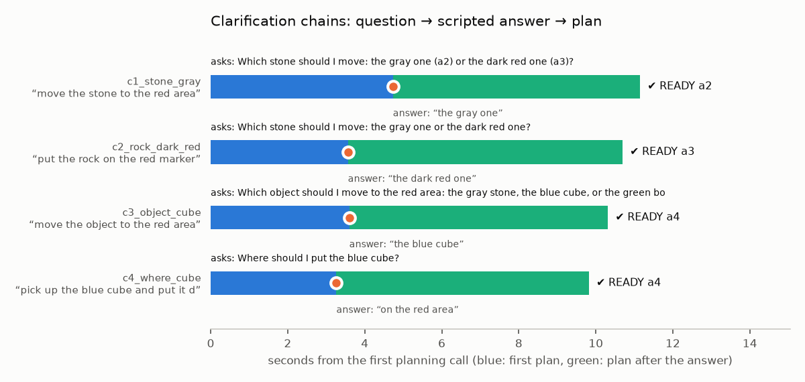

# Student B: clarification chains (E4)

Four ambiguous instructions, each with a scripted answer, on hand-built A-style scenes (live Qwen, cache off, thinking off). Tool: `python -m eval.b_clarification_chain --out runs/final/e4 --figs docs/night_run/figs`. **4/4**: B asked each time, then bound the answered object (and region) and returned READY.

| case | instruction | B asks | answer | final | goal object | plan calls (s) |
|---|---|---|---|---|---|---|
| c1_stone_gray | “move the stone to the red area” | Which stone should I move: the gray one (a2) or the dark red one (a3)? | “the gray one” | ✔ READY APPROACH › GRASP › MOVE_TO › PLACE › VERIFY › STOP | a2 | 4.7 + 6.4 |
| c2_rock_dark_red | “put the rock on the red marker” | Which stone should I move: the gray one or the dark red one? | “the dark red one” | ✔ READY APPROACH › GRASP › MOVE_TO › PLACE › VERIFY › STOP | a3 | 3.6 + 7.1 |
| c3_object_cube | “move the object to the red area” | Which object should I move to the red area: the gray stone, the blue cube, or the green bottle? | “the blue cube” | ✔ READY APPROACH › GRASP › MOVE_TO › PLACE › VERIFY › STOP | a4 | 3.6 + 6.7 |
| c4_where_cube | “pick up the blue cube and put it down somewhere” | Where should I put the blue cube? | “on the red area” | ✔ READY APPROACH › GRASP › MOVE_TO › PLACE › VERIFY › STOP | a4 | 3.3 + 6.6 |

