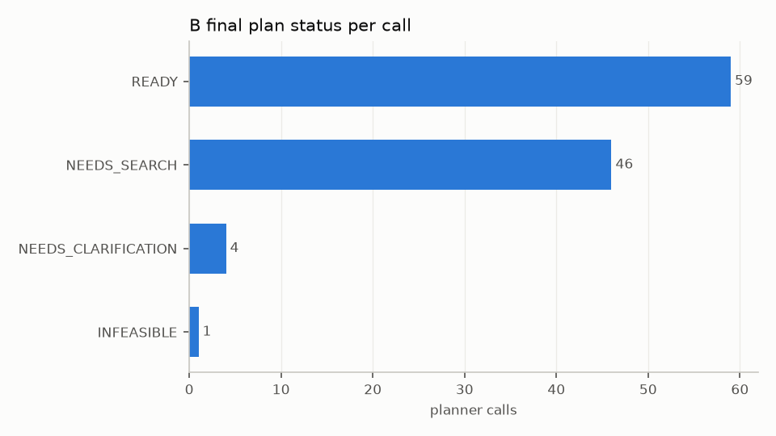
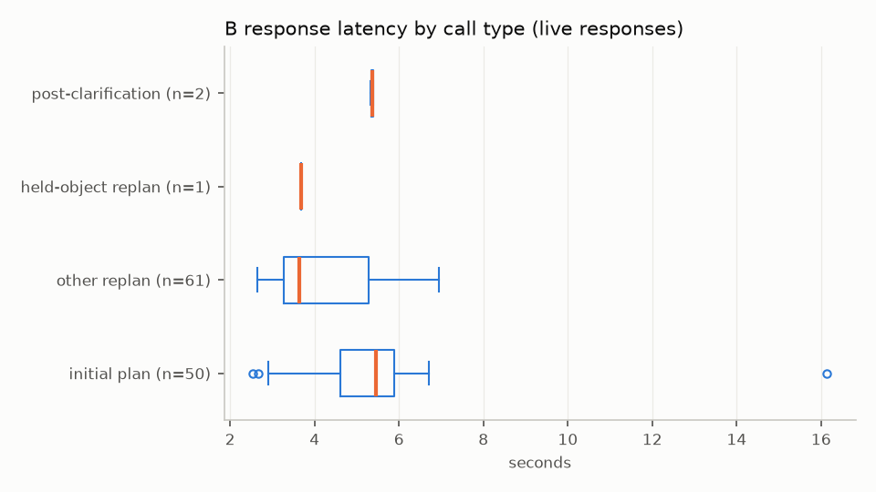
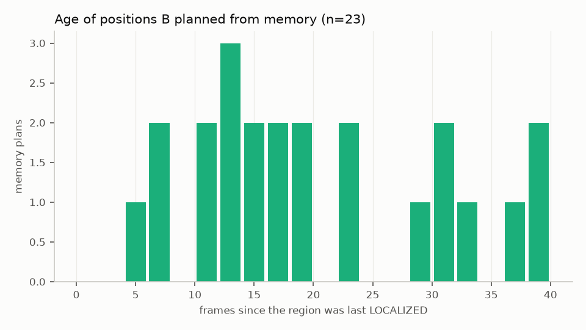

# Student B metrics

Source: every B audit under `runs/final/run_1` (live or cached responses only).

- planner calls (audits): 110
- first-pass-valid rate: 106/110 = 96.4%
- repair rate (calls that needed a repair): 4/110 = 3.6%
- repair success rate (accepted after repair): 4/4 = 100.0%
- accepted overall: 110/110 = 100.0%
- normalisations applied: 1 in total

**Validator ablation**: first responses the contract rejected before repair. Without the validator these plans would have gone to the robot as they were: **4/110**.

| first-response rejection reason | count |
|---|---|
| Original goal must keep region_id='a1' | 3 |
| Action 2: target needs a current, unambiguous 3D position | 1 |

| normalisation | count |
|---|---|
| {'field': 'status', 'change': 'READY with SEARCH -> NEEDS_SE | 1 |

| call type | calls | live responses | cached | prompt tokens | completion tokens | latency s |
|---|---|---|---|---|---|---|
| initial plan | 50 | 50 | 0 | mean 2651.4, median 2613.0 | mean 327.4, median 383.0 | mean 5.2, median 5.5 |
| held-object replan | 1 | 1 | 0 | mean 2980.0, median 2980.0 | mean 202.0, median 202.0 | mean 3.7, median 3.7 |
| post-clarification | 2 | 2 | 0 | mean 2703.0, median 2703.0 | mean 382.0, median 382.0 | mean 5.4, median 5.4 |
| other replan | 57 | 61 | 0 | mean 3112.9, median 3161.0 | mean 263.5, median 202.0 | mean 4.2, median 3.6 |

## Conversions

- READY with SEARCH -> NEEDS_SEARCH: 1
- repaired -> accepted: 4
- status:INFEASIBLE: 1
- status:NEEDS_CLARIFICATION: 4
- status:NEEDS_SEARCH: 46
- status:READY: 59

## Memory (B EpisodeMemory)

- B calls that planned from memory: 23/110 = 20.9%
- memory age (frames): mean 19.6, median 17.0, max 38
- status of memory plans: READY 10, NEEDS_SEARCH 13
- e2e trials matched to audits: 41
- trials with ≥ 1 memory plan: claimed∧achieved 2/8 = 25.0%
- trials without: claimed∧achieved 28/33 = 84.8%
- caveat: B only needs memory in episodes where the region left the view (SEARCH, re-grasp, long carries), so these two rates are not a controlled comparison.

## Figures

