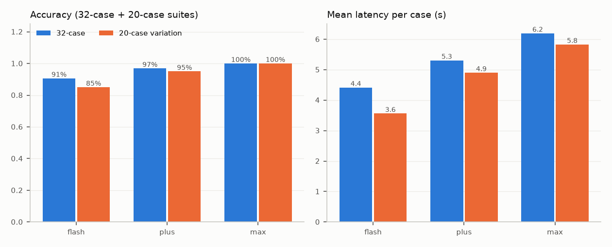

# Student B: Qwen tier comparison (E2)

Source: `runs/final/e2` (`eval.b_benchmark`, cache off, B thinking off, 2 workers). Cost = live tokens; the repo has no price list.

| model | suite | correct | first-response | latency mean / median (s) | calls | prompt tok | completion tok |
|---|---|---|---|---|---|---|---|
| qwen3.7-flash-2026-07-15 | eval | 29/32 (90.6%) | 87.5% | 4.4 / 4.0 | 40 | 100,817 | 12,167 |
| qwen3.7-flash-2026-07-15 | var | 17/20 (85.0%) | 80.0% | 3.6 / 4.0 | 21 | 53,705 | 5,743 |
| qwen3.7-plus-2026-05-26 | eval | 31/32 (96.9%) | 96.9% | 5.3 / 5.4 | 39 | 97,876 | 11,154 |
| qwen3.7-plus-2026-05-26 | var | 19/20 (95.0%) | 90.0% | 4.9 / 5.8 | 21 | 53,715 | 6,359 |
| qwen3.7-max-2026-06-08 | eval | 32/32 (100.0%) | 96.9% | 6.2 / 6.4 | 39 | 97,879 | 11,469 |
| qwen3.7-max-2026-06-08 | var | 20/20 (100.0%) | 95.0% | 5.8 / 6.7 | 21 | 53,700 | 6,691 |

## Failed checks

- **qwen3.7-flash-2026-07-15 eval**: status: expected NEEDS_SEARCH, got NEEDS_CLARIFICATION; object_id: expected i914, got i258; action 0: wrong approach target/state; action 1: wrong grasp target/order; action 2: wrong transport target/state; action 3: wrong placement target/order; action 4: wrong placement verification; status: expected NEEDS_SEARCH, got REJECTED
- **qwen3.7-flash-2026-07-15 var**: status: expected READY, got NEEDS_CLARIFICATION; object_id: expected v662, got ; status: expected READY, got NEEDS_CLARIFICATION; object_id: expected v642, got ; object_id: expected v194, got v514; action 0: wrong approach target/state; action 1: wrong grasp target/order; action 2: wrong transport target/state; action 3: wrong placement target/order; action 4: wrong placement verification
- **qwen3.7-plus-2026-05-26 eval**: status: expected INFEASIBLE, got REJECTED
- **qwen3.7-plus-2026-05-26 var**: object_id: expected v194, got v514; action 0: wrong approach target/state; action 1: wrong grasp target/order; action 2: wrong transport target/state; action 3: wrong placement target/order; action 4: wrong placement verification

